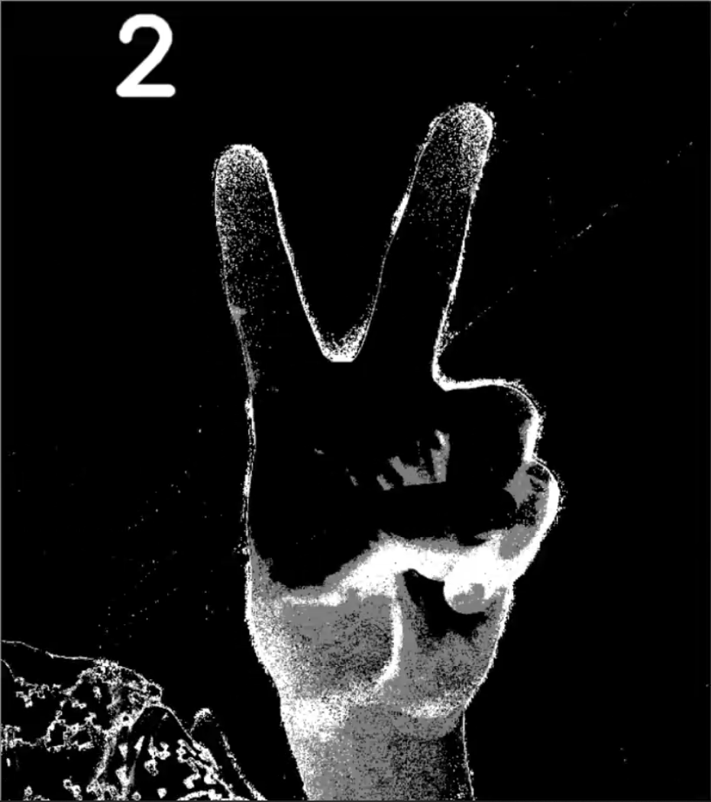

# 2020.05.31. 4.0 使用openpose 无奈在3G 1060显卡下无法做到实时 https://blog.csdn.net/liu24244/article/details/106452542
# 3.0 重新制作了数据集，能在白天的光照强度下达到95%+的识别率 
## 硬伤
- 1.是无法迁移到光照变为黑夜时 
- 2.实现的方式还是简单粗暴的直接丢进RESnet 进行分类
# hand_gesture_recognition
自制数据集进行实时手势识别 

B站视频 https://www.bilibili.com/video/av96416411?pop_share=1

